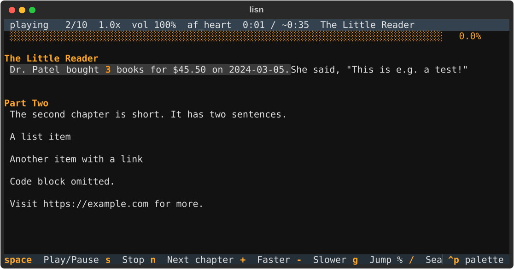

# lisn

**Read anything aloud, word for word, with the current sentence and word highlighted.**
Free, open source, runs entirely on your machine.

lisn turns PDFs, DOCX, EPUB, Google Docs, web articles, Markdown, plain text, your
clipboard or stdin into clean speech using [Kokoro-82M](https://huggingface.co/hexgrad/Kokoro-82M)
(default, CPU-friendly, word timings), [Piper](https://github.com/rhasspy/piper) (lightweight,
multilingual) or, optionally, Microsoft Edge's free online voices.



## Install

Requires Python 3.11 or 3.12 (Kokoro does not support 3.13 yet) and [uv](https://docs.astral.sh/uv/)
or pipx. This installs the `lisn` command for your user, usable from any terminal:

```bash
# from a checkout
git clone https://github.com/Gauravwagh/lisn && cd lisn
uv tool install --python 3.12 ".[all]"        # or: pipx install --python 3.12 ".[all]"

# straight from git
uv tool install --python 3.12 "lisn[all] @ git+https://github.com/Gauravwagh/lisn"

lisn --version
```

Make sure `~/.local/bin` is on your PATH (uv and pipx both print a hint if it is not).
To update after pulling changes: `uv tool install --reinstall ".[all]"`.

Extras: `extract` (pdf/docx/epub/web/clipboard), `piper`, `edge`, `server` (extension API),
`mcp`, `gdoc` (private Google Docs). `all` installs everything; the bare package reads
txt/markdown/stdin/clipboard with Kokoro only.

The first `lisn sample` or `lisn read` downloads the Kokoro model (~330 MB) into your
Hugging Face cache. After that everything runs offline.

### System dependencies per OS

| Dependency | Needed for | macOS | Ubuntu / Debian | Windows |
|---|---|---|---|---|
| **PortAudio** | audio playback (`sounddevice`) | bundled in the wheel | `sudo apt install libportaudio2` | bundled in the wheel |
| **ffmpeg** | `lisn export` to MP3 / M4B | `brew install ffmpeg` | `sudo apt install ffmpeg` | `winget install Gyan.FFmpeg` |
| **espeak-ng** | *not required*: Kokoro's `espeakng-loader` and Piper bundle the library | — | — | — |

No PortAudio? Use `--no-audio` (silent, for testing) or `lisn export`.

## Quick start

```bash
lisn sample "Hello! This is lisn reading to you."     # preview the default voice
lisn sample --voice bm_george "Good evening." -o g.wav   # save a WAV instead
lisn voices                                           # every voice per engine, with a sample command

lisn read notes.md                                    # TUI with highlighting; resumes where you left off
lisn read paper.pdf --from 40%                        # start at 40 %
lisn read book.epub --chapter 3                       # start at the 3rd chapter/heading
lisn read https://example.com/article                 # main article text only
lisn read "https://docs.google.com/document/d/<ID>/edit"   # public / anyone-with-link docs
cat notes.md | lisn read -                            # stdin
lisn read --clipboard                                 # whatever you just copied (e.g. a Claude artifact)
lisn read notes.md --voice am_michael --speed 1.3 --no-tui   # headless, same keys

lisn export book.epub -o book.m4b                     # audiobook with chapter markers (or .mp3 / .wav)
lisn history                                          # recently read items with progress %
lisn bookmarks                                        # bookmarks saved with the b key
lisn config set voice af_heart speed=1.3 engine=kokoro
lisn cache --clear
```

Flags on `read`: `--engine kokoro|piper|edge`, `--voice`, `--speed 0.5–3.0`,
`--highlight word|sentence`, `--from 40%`, `--chapter N`, `--no-resume`, `--no-tui`,
`--no-audio`, `--no-cache`, `--read-code`.

Where things live: config in the OS config dir (`lisn config path`), reading positions and
bookmarks in a SQLite file in the data dir, synthesized audio in the cache dir (`lisn cache`).

## Keyboard shortcuts (TUI and headless)

| Control | Key |
|---|---|
| Play / pause | `Space` |
| Stop | `s` |
| Next / previous sentence | `→` / `←` |
| Next / previous paragraph | `↓` / `↑` |
| Next / previous chapter or heading | `n` / `p` |
| Speed up / down (0.5x–3.0x, step 0.1, pitch preserved) | `+` / `-` |
| Volume up / down | `]` / `[` |
| Jump to % of document | `g` then a number |
| Search text and jump to it | `/` |
| Change voice live | `v` |
| Toggle word-level vs sentence-level highlight | `h` |
| Toggle auto-scroll | `a` |
| Bookmark current position | `b` |
| Repeat current sentence | `r` |
| Sleep timer (minutes) | `t` |
| Quit (saves position) | `q` |

Clicking a paragraph in the TUI jumps to it.

## Engines and voices

| Engine | Runs | Word timings | Languages | Notes |
|---|---|---|---|---|
| `kokoro` (default) | local, CPU/GPU | yes | en-US/GB, hi, es, fr, it, pt-BR (+ ja/zh with extras) | best quality; ~330 MB model |
| `piper` | local, CPU | no (proportional) | 30+ incl. Hindi | small ONNX voices, auto-downloaded on first use |
| `edge` | online (Microsoft) | yes | 100+ | free but not private; `--engine edge` |

```bash
lisn read notes.md --engine piper --voice hi_IN-pratham-medium
lisn read notes.md --engine edge --voice en-IN-NeerjaNeural
```

## Browser extension (Chrome / Edge)

1. Run `lisn serve` (prints the auth token; `lisn serve --show-token` any time).
2. Open `chrome://extensions`, enable Developer mode, **Load unpacked** → the `extension/` folder.
3. Click the extension icon, paste the token, Save.
4. Toolbar button or `Alt+Shift+L` reads the page; right-click → **Read selection with lisn**.

The spoken sentence and word are highlighted in the page (CSS Highlight API) and a floating
bar offers play/pause, previous/next, speed and stop. If `lisn serve` is not running, the
browser's own Web Speech voice is used and a notice says so. Works on claude.ai responses
and artifacts via selection; Google Docs are fetched through the export endpoint.

## Private Google Docs

Google does not allow shipping OAuth secrets, so create a "Desktop app" OAuth client in
Google Cloud Console (Drive API enabled), download its JSON and run once:

```bash
lisn gdoc login ~/Downloads/client_secret.json    # read-only Drive scope; token cached locally
lisn gdoc logout
```

## Use from Claude Code, Codex CLI or Gemini CLI

lisn ships an **agent skill** (`SKILL.md`, the format all three CLIs share) that teaches the
agent when and how to read aloud, plus an **MCP server** with the playback tools. One command
installs both into every CLI it finds, user-wide:

```bash
lisn setup                  # Claude Code + Codex CLI + Gemini CLI
lisn setup --claude         # just one of them (--codex, --gemini)
lisn setup --no-mcp         # skill only
lisn setup --uninstall      # remove the skill and the MCP registration again
```

It writes `~/.claude/skills/lisn/SKILL.md`, `~/.codex/skills/lisn/SKILL.md` and
`~/.gemini/skills/lisn/SKILL.md`, and runs each CLI's own `mcp add`. Restart the CLIs afterwards.
If you prefer to do it by hand:

```bash
claude mcp add --scope user lisn -- lisn mcp      # Claude Code
codex mcp add lisn -- lisn mcp                    # Codex CLI
gemini mcp add --scope user lisn lisn mcp         # Gemini CLI
```

Any other MCP client works with the stdio command `lisn mcp`, for example in JSON:

```json
{ "mcpServers": { "lisn": { "command": "lisn", "args": ["mcp"] } } }
```

Tools exposed: `read_aloud(text | path | url, voice?, speed?)`, `pause`, `resume`, `stop`,
`skip(sentences)`, `set_speed(speed)`, `status`, `export_audio(out_path, text | path | url)`.
Audio plays on the machine the agent runs on.

Then ask in plain words:

- "Read your last answer to me." (the agent passes its own text to `read_aloud`)
- "Read README.md aloud." / "Read ~/Downloads/paper.pdf." / "Read this article: <url>."
- "Pause." "Resume." "Skip ahead three sentences." "Faster." "Stop."
- "Export docs/plan.md to ~/plan.m4b."

The skill makes the agent reach for `read_aloud` on its own and tells it how to turn its
markdown answer into readable prose. If you skipped the skill, say once: "When I ask you to
read something, use the lisn `read_aloud` tool." The first read after the CLI starts can take
about five seconds while the voice model loads; the server pre-loads it in the background.

Without MCP: in Claude Code the `!` prefix runs a shell command in the session, so copy the
text you want and run `! lisn read --clipboard --no-tui`, or ask the agent to run
`lisn read <file> --no-tui`. For the full TUI with highlighting, use a second terminal tab.

## How it works

1. **Extract** the source into headings and paragraphs (PDF: running headers, footers, page
   numbers and footnote markers are dropped, hyphenated line breaks are joined, two-column
   pages are read column by column).
2. **Normalize** unicode (ligatures, smart quotes, odd spaces) and **expand** for speech:
   `$1,500.50` → "one thousand, five hundred dollars and fifty cents", `e.g.` → "for example",
   `2024-03-05` → "March fifth, twenty twenty four", URLs → "link".
3. **Segment** into sentences with `pysbd` (not a regex on "."), splitting over-long sentences
   at clause boundaries. Every sentence gets a stable id for resume.
4. **Synthesize ahead**: the next 3 sentences are always pre-generated on a worker thread;
   audio is cached on disk keyed by `hash(engine, voice, speed, text)`.
5. **Play** through a callback-driven PortAudio stream, and map the engine's word timings
   back to the words on screen so the highlight follows the voice.

## Troubleshooting

- **"No module named sounddevice" / PortAudio errors on Linux**: `sudo apt install libportaudio2`.
- **No sound but no error**: check the default output device; `lisn sample -o test.wav` proves
  synthesis works independently of playback.
- **Slow first sentence**: the model loads on first use (~4-5 s). Later sentences are cached,
  and the next 3 are always synthesized ahead.
- **Garbled or skipped text in a PDF**: scanned PDFs have no text layer; OCR them first.
  Headers, footers and page numbers are dropped on purpose.
- **Private Google Doc refused**: share it as "Anyone with the link" or run `lisn gdoc login`.
- **Extension says "lisn serve is not running"**: start `lisn serve` and check the token in
  the popup (`lisn serve --show-token`).

## Development

```bash
uv venv --python 3.12 && uv pip install -e ".[all,dev]"
pytest -m "not slow"          # fast unit tests (fake engine, no audio device)
pytest -m slow                # loads the Kokoro model, writes a WAV end to end
pytest --cov=lisn
ruff check . && ruff format .
python tests/fixtures/make_fixtures.py    # regenerate the pdf/docx/epub/html fixtures
python docs/make_screenshot.py            # regenerate docs/tui.svg
```

See [AGENTS.md](AGENTS.md) for the architecture, invariants and known gaps.

## License

MIT
